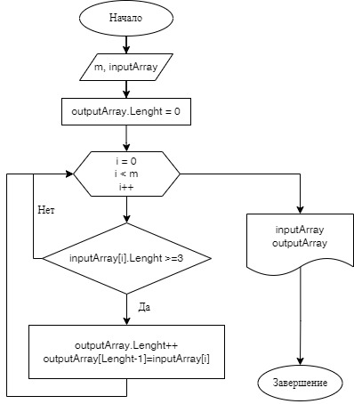

# Итоговая проверочная работа: Написать программу, которая из имеющегося массива строк формирует массив из строк, длина которых меньше либо равна 3

## Блок схема алгоритма

## Описание алгоритма
*Прошу обратить внимание, что в блок-схеме не показаны действия по заполнению массива строками. В реализации программы пользователь вводит количество элементов массива, а затем в цикле вводит каждый элемент массива. В блок-схеме в блоке ввода данных сразу вводится количество элементов массива и сам массив.*

На входе имеется одномерный массив строк. Для выходного массива устанавливается нулевая длина. В цикле перебирается каждый элемент входного массива, и, если длина строки этого элемента больше или равна трем, то длина выходного массива увеличивается на единицу и в элемент с индексом равным длине данного массива минус 1 вносится данная строка. На выходе выводится на печать входной и выходной массивы.

## Реализация на C#
С использованием метода `GetConsoleData` вводится размерность массива строк. Затем с помощью метода `FillArray` пользователь вносит поэлементно строковые данные в массив. Далее метод `ChangeArray` согласно условиям задачи формирует выходной массив. Работа программы заканчивается выводом в консоль входного и выходного массивов.
